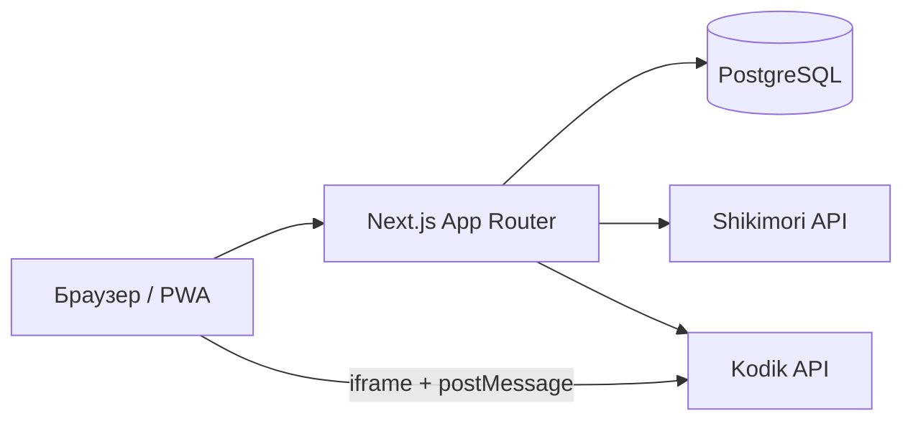

<div align="center">


# Track Anime

**Веб-приложение для просмотра аниме** с интеграцией [Shikimori](https://shikimori.one) и [Kodik](https://kodik.info).

[](https://ta.dygdyg.ru/)
[](https://nextjs.org/)
[](https://react.dev/)
[](https://www.typescriptlang.org/)
[](https://www.postgresql.org/)
[](https://www.prisma.io/)
[](https://tailwindcss.com/)

Вход через Shikimori · встроенный Kodik-плеер · списки и прогресс просмотра · PWA

[Открыть сайт](https://ta.dygdyg.ru/) · [Быстрый старт](#быстрый-старт) · [Документация](#документация)

</div>

---

## О проекте

Track Anime — self-hosted платформа для просмотра аниме. Пользователи авторизуются через Shikimori OAuth, выбирают озвучку из каталога Kodik, смотрят серии во встроенном плеере и синхронизируют списки. Данные хранятся в PostgreSQL; внешние API вызываются только с сервера.



---

## Возможности

| | |
|---|---|
| 📺 **Лента релизов** | Новые серии с бесконечной прокруткой |
| 🎬 **Страница аниме** | Метаданные Shikimori, выбор озвучки, Kodik-плеер с сохранением позиции |
| 🔍 **Поиск** | Быстрый и расширенный — поля, жанры, год, мин. рейтинг Shikimori |
| ⭐ **Избранное** | Локальный кэш списков Shikimori (смотрю, в планах и др.) |
| 📜 **История** | Сезон, серия, прогресс в секундах |
| 📅 **Календарь** | Расписание выхода серий ongoing-аниме |
| 👤 **Профили** | Публичные страницы пользователей по Shikimori ID |
| 📱 **PWA** | Установка как приложение, офлайн-страница |
| 🔔 **Уведомления** | Browser push, in-app лента, Discord/Telegram/VK привязки |
| 🎮 **Discord RPC** | Статус «смотрю» через локальный tray-приложение |
| 👥 **Совместный просмотр** | Настраиваемые WebSocket-комнаты beta-плеера с invite-ссылкой, мастером и гостевыми именами |
| ⚙️ **Админка** | Импорт Kodik, sync, настройки, DB explorer |

---

## Стек

| Слой | Технологии |
|------|------------|
| **Frontend** | Next.js 16 (App Router), React 19, Tailwind CSS, Serwist (PWA) |
| **Backend** | Next.js API Routes, TypeScript |
| **База данных** | PostgreSQL 16, Prisma 6 |
| **Аутентификация** | Shikimori OAuth2 (custom, без NextAuth) |
| **Видео** | Kodik iframe + postMessage API |

> **Принцип:** браузер не обращается напрямую к Shikimori/Kodik — только через серверные модули. Ключ данных: `shikimoriId` → `/anime/[shikimoriId]`.

---

## Быстрый старт

### Требования

- **Node.js** 20+
- **Docker** (для PostgreSQL) или свой экземпляр Postgres
- **Kodik API token** — [bd.kodikres.com](https://bd.kodikres.com)
- **Shikimori OAuth app** — [shikimori.one/oauth/applications](https://shikimori.one/oauth/applications)

### 1. Клонирование и зависимости

```bash
git clone https://github.com/DygDyg/track-anime.git
cd track-anime
npm ci
cp .env.example .env
```

Заполните в `.env` как минимум: `DATABASE_URL`, `KODIK_API_TOKEN`, `SHIKIMORI_CLIENT_ID`, `SHIKIMORI_CLIENT_SECRET`, `AUTH_URL`.

### 2. База данных

```bash
npm run docker:up      # PostgreSQL в Docker
npm run db:push        # применить схему Prisma
```

### 3. Импорт каталога Kodik

```bash
npm run kodik:import           # полный импорт
npm run kodik:import:resume    # продолжить прерванный
npm run kodik:sync             # инкрементальный sync
```

> Без импорта/sync лента на главной будет пустой — данные берутся из таблицы `KodikEpisodeRelease`.

### 4. Запуск

```bash
npm run dev
```

Сайт: **http://localhost:3000**

Redirect URI в настройках Shikimori OAuth для dev:

```
http://localhost:3000/api/auth/callback/shikimori
```

---

## Основные команды

| Команда | Описание |
|---------|----------|
| `npm run dev` | Dev-сервер Next.js (`0.0.0.0`, удобно с телефона в LAN) |
| `start-dev.bat` | Windows-запуск dev: Docker/PostgreSQL, Prisma schema, WebSocket-комнаты и Next.js |
| `npm run build` | Production-сборка |
| `npm run start` | Запуск production |
| `npm run db:studio` | Prisma Studio |
| `npm run db:backup` | Dump локальной PostgreSQL БД из Docker в `backups/db` |
| `npm run db:pull-prod` | Скачать dump production БД в `backups/db` |
| `npm run db:restore-prod` | Скачать production dump и перезаписать локальную dev БД |
| `npm run kodik:sync` | Sync новых материалов Kodik |
| `npm run kodik:sync:scheduled` | Sync для cron |
| `npm run watch-party:server` | WebSocket-сервер комнат совместного просмотра |
| `npm run deploy` | Деплой на production (Windows) |

Полный список скриптов — в [`package.json`](package.json).

---

## Переменные окружения

| Переменная | Назначение |
|------------|------------|
| `DATABASE_URL` | PostgreSQL connection string |
| `KODIK_API_TOKEN` | Токен Kodik API |
| `SHIKIMORI_CLIENT_ID` | OAuth client ID |
| `SHIKIMORI_CLIENT_SECRET` | OAuth client secret |
| `AUTH_URL` | Базовый URL сайта (для OAuth redirect) |
| `ADMIN_SHIKIMORI_IDS` | Shikimori ID админов через запятую |
| `WATCH_PARTY_PORT` / `NEXT_PUBLIC_WATCH_PARTY_WS_URL` | Порт и публичный URL WebSocket-сервера совместного просмотра |

Подробные комментарии и опциональные переменные — в [`.env.example`](.env.example).

---

## Структура проекта

```
src/
├── app/           # страницы и API routes (App Router)
├── components/    # React-компоненты
├── lib/           # серверная логика: auth, search, sync, posters
├── kodik/         # HTTP-клиент Kodik API
└── hooks/         # React-хуки

prisma/            # схема БД
scripts/           # импорт, sync, deploy, Discord tray
docs/              # справочники API (Kodik, Shikimori)
```

---

## Деплой

Production-сервер и подробности — в [`docs/DEPLOY.md`](docs/DEPLOY.md).

```powershell
npm run deploy              # обычный деплой
npm run deploy:release      # деплой + пересборка Discord RPC exe
```

---

## Документация

| Файл | Содержание |
|------|------------|
| [`PROJECT_OVERVIEW.md`](PROJECT_OVERVIEW.md) | Обзор проекта |
| [`AGENTS.md`](AGENTS.md) | Правила для Codex |
| [`AI_RULES.md`](AI_RULES.md) | Общие правила для AI-ассистентов |
| [`AI_CONTEXT.md`](AI_CONTEXT.md) | Быстрый контекст для Codex/Cursor |
| [`ARCHITECTURE.md`](ARCHITECTURE.md) | Архитектура и потоки данных |
| [`CODEBASE_MAP.md`](CODEBASE_MAP.md) | Карта кодовой базы |
| [`docs/WINDOWS_REINSTALL.md`](docs/WINDOWS_REINSTALL.md) | Переустановка Windows / новый ПК для разработки |
| [`docs/SERVER.md`](docs/SERVER.md) | Production-сервер |
| [`docs/DEPLOY.md`](docs/DEPLOY.md) | Деплой с Windows |
| [`docs/kodik-api/`](docs/kodik-api/) | Справочник Kodik API |
| [`docs/shikimori-api/`](docs/shikimori-api/) | Справочник Shikimori API |

---

## Лицензия

Private repository. All rights reserved.
