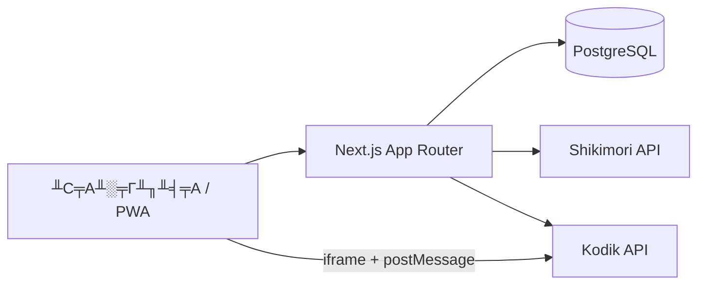

<div align="center">


# Track Anime

**╨Т╨╡╨▒-╨┐╤А╨╕╨╗╨╛╨╢╨╡╨╜╨╕╨╡ ╨┤╨╗╤П ╨┐╤А╨╛╤Б╨╝╨╛╤В╤А╨░ ╨░╨╜╨╕╨╝╨╡** ╤Б ╨╕╨╜╤В╨╡╨│╤А╨░╤Ж╨╕╨╡╨╣ [Shikimori](https://shikimori.one) ╨╕ [Kodik](https://kodik.info).

[](https://ta.dygdyg.ru/)
[](https://nextjs.org/)
[](https://react.dev/)
[](https://www.typescriptlang.org/)
[](https://www.postgresql.org/)
[](https://www.prisma.io/)
[](https://tailwindcss.com/)

╨Т╤Е╨╛╨┤ ╤З╨╡╤А╨╡╨╖ Shikimori ┬╖ ╨▓╤Б╤В╤А╨╛╨╡╨╜╨╜╤Л╨╣ Kodik-╨┐╨╗╨╡╨╡╤А ┬╖ ╤Б╨┐╨╕╤Б╨║╨╕ ╨╕ ╨┐╤А╨╛╨│╤А╨╡╤Б╤Б ╨┐╤А╨╛╤Б╨╝╨╛╤В╤А╨░ ┬╖ PWA

[╨Ю╤В╨║╤А╤Л╤В╤М ╤Б╨░╨╣╤В](https://ta.dygdyg.ru/) ┬╖ [╨С╤Л╤Б╤В╤А╤Л╨╣ ╤Б╤В╨░╤А╤В](#╨▒╤Л╤Б╤В╤А╤Л╨╣-╤Б╤В╨░╤А╤В) ┬╖ [╨Ф╨╛╨║╤Г╨╝╨╡╨╜╤В╨░╤Ж╨╕╤П](#╨┤╨╛╨║╤Г╨╝╨╡╨╜╤В╨░╤Ж╨╕╤П)

</div>

---

## ╨Ю ╨┐╤А╨╛╨╡╨║╤В╨╡

Track Anime тАФ self-hosted ╨┐╨╗╨░╤В╤Д╨╛╤А╨╝╨░ ╨┤╨╗╤П ╨┐╤А╨╛╤Б╨╝╨╛╤В╤А╨░ ╨░╨╜╨╕╨╝╨╡. ╨Я╨╛╨╗╤М╨╖╨╛╨▓╨░╤В╨╡╨╗╨╕ ╨░╨▓╤В╨╛╤А╨╕╨╖╤Г╤О╤В╤Б╤П ╤З╨╡╤А╨╡╨╖ Shikimori OAuth, ╨▓╤Л╨▒╨╕╤А╨░╤О╤В ╨╛╨╖╨▓╤Г╤З╨║╤Г ╨╕╨╖ ╨║╨░╤В╨░╨╗╨╛╨│╨░ Kodik, ╤Б╨╝╨╛╤В╤А╤П╤В ╤Б╨╡╤А╨╕╨╕ ╨▓╨╛ ╨▓╤Б╤В╤А╨╛╨╡╨╜╨╜╨╛╨╝ ╨┐╨╗╨╡╨╡╤А╨╡ ╨╕ ╤Б╨╕╨╜╤Е╤А╨╛╨╜╨╕╨╖╨╕╤А╤Г╤О╤В ╤Б╨┐╨╕╤Б╨║╨╕. ╨Ф╨░╨╜╨╜╤Л╨╡ ╤Е╤А╨░╨╜╤П╤В╤Б╤П ╨▓ PostgreSQL; ╨▓╨╜╨╡╤И╨╜╨╕╨╡ API ╨▓╤Л╨╖╤Л╨▓╨░╤О╤В╤Б╤П ╤В╨╛╨╗╤М╨║╨╛ ╤Б ╤Б╨╡╤А╨▓╨╡╤А╨░.



---

## ╨Т╨╛╨╖╨╝╨╛╨╢╨╜╨╛╤Б╤В╨╕

| | |
|---|---|
| ЁЯУ║ **╨Ы╨╡╨╜╤В╨░ ╤А╨╡╨╗╨╕╨╖╨╛╨▓** | ╨Э╨╛╨▓╤Л╨╡ ╤Б╨╡╤А╨╕╨╕ ╤Б ╨▒╨╡╤Б╨║╨╛╨╜╨╡╤З╨╜╨╛╨╣ ╨┐╤А╨╛╨║╤А╤Г╤В╨║╨╛╨╣ |
| ЁЯОм **╨б╤В╤А╨░╨╜╨╕╤Ж╨░ ╨░╨╜╨╕╨╝╨╡** | ╨Ь╨╡╤В╨░╨┤╨░╨╜╨╜╤Л╨╡ Shikimori, ╨▓╤Л╨▒╨╛╤А ╨╛╨╖╨▓╤Г╤З╨║╨╕, Kodik-╨┐╨╗╨╡╨╡╤А ╤Б ╤Б╨╛╤Е╤А╨░╨╜╨╡╨╜╨╕╨╡╨╝ ╨┐╨╛╨╖╨╕╤Ж╨╕╨╕ |
| ЁЯФН **╨Я╨╛╨╕╤Б╨║** | ╨С╤Л╤Б╤В╤А╤Л╨╣ ╨╕ ╤А╨░╤Б╤И╨╕╤А╨╡╨╜╨╜╤Л╨╣ тАФ ╨┐╨╛╨╗╤П, ╨╢╨░╨╜╤А╤Л, ╨│╨╛╨┤, ╨╝╨╕╨╜. ╤А╨╡╨╣╤В╨╕╨╜╨│ Shikimori |
| тнР **╨Ш╨╖╨▒╤А╨░╨╜╨╜╨╛╨╡** | ╨Ы╨╛╨║╨░╨╗╤М╨╜╤Л╨╣ ╨║╤Н╤И ╤Б╨┐╨╕╤Б╨║╨╛╨▓ Shikimori (╤Б╨╝╨╛╤В╤А╤О, ╨▓ ╨┐╨╗╨░╨╜╨░╤Е ╨╕ ╨┤╤А.) |
| ЁЯУЬ **╨Ш╤Б╤В╨╛╤А╨╕╤П** | ╨б╨╡╨╖╨╛╨╜, ╤Б╨╡╤А╨╕╤П, ╨┐╤А╨╛╨│╤А╨╡╤Б╤Б ╨▓ ╤Б╨╡╨║╤Г╨╜╨┤╨░╤Е |
| ЁЯУЕ **╨Ъ╨░╨╗╨╡╨╜╨┤╨░╤А╤М** | ╨а╨░╤Б╨┐╨╕╤Б╨░╨╜╨╕╨╡ ╨▓╤Л╤Е╨╛╨┤╨░ ╤Б╨╡╤А╨╕╨╣ ongoing-╨░╨╜╨╕╨╝╨╡ |
| ЁЯСд **╨Я╤А╨╛╤Д╨╕╨╗╨╕** | ╨Я╤Г╨▒╨╗╨╕╤З╨╜╤Л╨╡ ╤Б╤В╤А╨░╨╜╨╕╤Ж╤Л ╨┐╨╛╨╗╤М╨╖╨╛╨▓╨░╤В╨╡╨╗╨╡╨╣ ╨┐╨╛ Shikimori ID |
| ЁЯУ▒ **PWA** | ╨г╤Б╤В╨░╨╜╨╛╨▓╨║╨░ ╨║╨░╨║ ╨┐╤А╨╕╨╗╨╛╨╢╨╡╨╜╨╕╨╡, ╨╛╤Д╨╗╨░╨╣╨╜-╤Б╤В╤А╨░╨╜╨╕╤Ж╨░ |
| ЁЯОо **Discord RPC** | ╨б╤В╨░╤В╤Г╤Б ┬л╤Б╨╝╨╛╤В╤А╤О┬╗ ╤З╨╡╤А╨╡╨╖ ╨╗╨╛╨║╨░╨╗╤М╨╜╤Л╨╣ tray-╨┐╤А╨╕╨╗╨╛╨╢╨╡╨╜╨╕╨╡ |
| тЪЩя╕П **╨Р╨┤╨╝╨╕╨╜╨║╨░** | ╨Ш╨╝╨┐╨╛╤А╤В Kodik, sync, ╨╜╨░╤Б╤В╤А╨╛╨╣╨║╨╕, DB explorer |

---

## ╨б╤В╨╡╨║

| ╨б╨╗╨╛╨╣ | ╨в╨╡╤Е╨╜╨╛╨╗╨╛╨│╨╕╨╕ |
|------|------------|
| **Frontend** | Next.js 16 (App Router), React 19, Tailwind CSS, Serwist (PWA) |
| **Backend** | Next.js API Routes, TypeScript |
| **╨С╨░╨╖╨░ ╨┤╨░╨╜╨╜╤Л╤Е** | PostgreSQL 16, Prisma 6 |
| **╨Р╤Г╤В╨╡╨╜╤В╨╕╤Д╨╕╨║╨░╤Ж╨╕╤П** | Shikimori OAuth2 (custom, ╨▒╨╡╨╖ NextAuth) |
| **╨Т╨╕╨┤╨╡╨╛** | Kodik iframe + postMessage API |

> **╨Я╤А╨╕╨╜╤Ж╨╕╨┐:** ╨▒╤А╨░╤Г╨╖╨╡╤А ╨╜╨╡ ╨╛╨▒╤А╨░╤Й╨░╨╡╤В╤Б╤П ╨╜╨░╨┐╤А╤П╨╝╤Г╤О ╨║ Shikimori/Kodik тАФ ╤В╨╛╨╗╤М╨║╨╛ ╤З╨╡╤А╨╡╨╖ ╤Б╨╡╤А╨▓╨╡╤А╨╜╤Л╨╡ ╨╝╨╛╨┤╤Г╨╗╨╕. ╨Ъ╨╗╤О╤З ╨┤╨░╨╜╨╜╤Л╤Е: `shikimoriId` тЖТ `/anime/[shikimoriId]`.

---

## ╨С╤Л╤Б╤В╤А╤Л╨╣ ╤Б╤В╨░╤А╤В

### ╨в╤А╨╡╨▒╨╛╨▓╨░╨╜╨╕╤П

- **Node.js** 20+
- **Docker** (╨┤╨╗╤П PostgreSQL) ╨╕╨╗╨╕ ╤Б╨▓╨╛╨╣ ╤Н╨║╨╖╨╡╨╝╨┐╨╗╤П╤А Postgres
- **Kodik API token** тАФ [bd.kodikres.com](https://bd.kodikres.com)
- **Shikimori OAuth app** тАФ [shikimori.one/oauth/applications](https://shikimori.one/oauth/applications)

### 1. ╨Ъ╨╗╨╛╨╜╨╕╤А╨╛╨▓╨░╨╜╨╕╨╡ ╨╕ ╨╖╨░╨▓╨╕╤Б╨╕╨╝╨╛╤Б╤В╨╕

```bash
git clone https://github.com/DygDyg/track-anime.git
cd track-anime
npm ci
cp .env.example .env
```

╨Ч╨░╨┐╨╛╨╗╨╜╨╕╤В╨╡ ╨▓ `.env` ╨║╨░╨║ ╨╝╨╕╨╜╨╕╨╝╤Г╨╝: `DATABASE_URL`, `KODIK_API_TOKEN`, `SHIKIMORI_CLIENT_ID`, `SHIKIMORI_CLIENT_SECRET`, `AUTH_URL`.

### 2. ╨С╨░╨╖╨░ ╨┤╨░╨╜╨╜╤Л╤Е

```bash
npm run docker:up      # PostgreSQL ╨▓ Docker
npm run db:push        # ╨┐╤А╨╕╨╝╨╡╨╜╨╕╤В╤М ╤Б╤Е╨╡╨╝╤Г Prisma
```

### 3. ╨Ш╨╝╨┐╨╛╤А╤В ╨║╨░╤В╨░╨╗╨╛╨│╨░ Kodik

```bash
npm run kodik:import           # ╨┐╨╛╨╗╨╜╤Л╨╣ ╨╕╨╝╨┐╨╛╤А╤В
npm run kodik:import:resume    # ╨┐╤А╨╛╨┤╨╛╨╗╨╢╨╕╤В╤М ╨┐╤А╨╡╤А╨▓╨░╨╜╨╜╤Л╨╣
npm run kodik:sync             # ╨╕╨╜╨║╤А╨╡╨╝╨╡╨╜╤В╨░╨╗╤М╨╜╤Л╨╣ sync
```

> ╨С╨╡╨╖ ╨╕╨╝╨┐╨╛╤А╤В╨░/sync ╨╗╨╡╨╜╤В╨░ ╨╜╨░ ╨│╨╗╨░╨▓╨╜╨╛╨╣ ╨▒╤Г╨┤╨╡╤В ╨┐╤Г╤Б╤В╨╛╨╣ тАФ ╨┤╨░╨╜╨╜╤Л╨╡ ╨▒╨╡╤А╤Г╤В╤Б╤П ╨╕╨╖ ╤В╨░╨▒╨╗╨╕╤Ж╤Л `KodikEpisodeRelease`.

### 4. ╨Ч╨░╨┐╤Г╤Б╨║

```bash
npm run dev
```

╨б╨░╨╣╤В: **http://localhost:3000**

Redirect URI ╨▓ ╨╜╨░╤Б╤В╤А╨╛╨╣╨║╨░╤Е Shikimori OAuth ╨┤╨╗╤П dev:

```
http://localhost:3000/api/auth/callback/shikimori
```

---

## ╨Ю╤Б╨╜╨╛╨▓╨╜╤Л╨╡ ╨║╨╛╨╝╨░╨╜╨┤╤Л

| ╨Ъ╨╛╨╝╨░╨╜╨┤╨░ | ╨Ю╨┐╨╕╤Б╨░╨╜╨╕╨╡ |
|---------|----------|
| `npm run dev` | Dev-╤Б╨╡╤А╨▓╨╡╤А Next.js (`0.0.0.0`, ╤Г╨┤╨╛╨▒╨╜╨╛ ╤Б ╤В╨╡╨╗╨╡╤Д╨╛╨╜╨░ ╨▓ LAN) |
| `npm run build` | Production-╤Б╨▒╨╛╤А╨║╨░ |
| `npm run start` | ╨Ч╨░╨┐╤Г╤Б╨║ production |
| `npm run db:studio` | Prisma Studio |
| `npm run kodik:sync` | Sync ╨╜╨╛╨▓╤Л╤Е ╨╝╨░╤В╨╡╤А╨╕╨░╨╗╨╛╨▓ Kodik |
| `npm run kodik:sync:scheduled` | Sync ╨┤╨╗╤П cron |
| `npm run deploy` | ╨Ф╨╡╨┐╨╗╨╛╨╣ ╨╜╨░ production (Windows) |

╨Я╨╛╨╗╨╜╤Л╨╣ ╤Б╨┐╨╕╤Б╨╛╨║ ╤Б╨║╤А╨╕╨┐╤В╨╛╨▓ тАФ ╨▓ [`package.json`](package.json).

---

## ╨Я╨╡╤А╨╡╨╝╨╡╨╜╨╜╤Л╨╡ ╨╛╨║╤А╤Г╨╢╨╡╨╜╨╕╤П

| ╨Я╨╡╤А╨╡╨╝╨╡╨╜╨╜╨░╤П | ╨Э╨░╨╖╨╜╨░╤З╨╡╨╜╨╕╨╡ |
|------------|------------|
| `DATABASE_URL` | PostgreSQL connection string |
| `KODIK_API_TOKEN` | ╨в╨╛╨║╨╡╨╜ Kodik API |
| `SHIKIMORI_CLIENT_ID` | OAuth client ID |
| `SHIKIMORI_CLIENT_SECRET` | OAuth client secret |
| `AUTH_URL` | ╨С╨░╨╖╨╛╨▓╤Л╨╣ URL ╤Б╨░╨╣╤В╨░ (╨┤╨╗╤П OAuth redirect) |
| `ADMIN_SHIKIMORI_IDS` | Shikimori ID ╨░╨┤╨╝╨╕╨╜╨╛╨▓ ╤З╨╡╤А╨╡╨╖ ╨╖╨░╨┐╤П╤В╤Г╤О |

╨Я╨╛╨┤╤А╨╛╨▒╨╜╤Л╨╡ ╨║╨╛╨╝╨╝╨╡╨╜╤В╨░╤А╨╕╨╕ ╨╕ ╨╛╨┐╤Ж╨╕╨╛╨╜╨░╨╗╤М╨╜╤Л╨╡ ╨┐╨╡╤А╨╡╨╝╨╡╨╜╨╜╤Л╨╡ тАФ ╨▓ [`.env.example`](.env.example).

---

## ╨б╤В╤А╤Г╨║╤В╤Г╤А╨░ ╨┐╤А╨╛╨╡╨║╤В╨░

```
src/
тФЬтФАтФА app/           # ╤Б╤В╤А╨░╨╜╨╕╤Ж╤Л ╨╕ API routes (App Router)
тФЬтФАтФА components/    # React-╨║╨╛╨╝╨┐╨╛╨╜╨╡╨╜╤В╤Л
тФЬтФАтФА lib/           # ╤Б╨╡╤А╨▓╨╡╤А╨╜╨░╤П ╨╗╨╛╨│╨╕╨║╨░: auth, search, sync, posters
тФЬтФАтФА kodik/         # HTTP-╨║╨╗╨╕╨╡╨╜╤В Kodik API
тФФтФАтФА hooks/         # React-╤Е╤Г╨║╨╕

prisma/            # ╤Б╤Е╨╡╨╝╨░ ╨С╨Ф
scripts/           # ╨╕╨╝╨┐╨╛╤А╤В, sync, deploy, Discord tray
docs/              # ╤Б╨┐╤А╨░╨▓╨╛╤З╨╜╨╕╨║╨╕ API (Kodik, Shikimori)
```

---

## ╨Ф╨╡╨┐╨╗╨╛╨╣

Production-╤Б╨╡╤А╨▓╨╡╤А ╨╕ ╨┐╨╛╨┤╤А╨╛╨▒╨╜╨╛╤Б╤В╨╕ тАФ ╨▓ [`docs/DEPLOY.md`](docs/DEPLOY.md).

```powershell
npm run deploy              # ╨╛╨▒╤Л╤З╨╜╤Л╨╣ ╨┤╨╡╨┐╨╗╨╛╨╣
npm run deploy:release      # ╨┤╨╡╨┐╨╗╨╛╨╣ + ╨┐╨╡╤А╨╡╤Б╨▒╨╛╤А╨║╨░ Discord RPC exe
```

---

## ╨Ф╨╛╨║╤Г╨╝╨╡╨╜╤В╨░╤Ж╨╕╤П

| ╨д╨░╨╣╨╗ | ╨б╨╛╨┤╨╡╤А╨╢╨░╨╜╨╕╨╡ |
|------|------------|
| [`PROJECT_OVERVIEW.md`](PROJECT_OVERVIEW.md) | ╨Ю╨▒╨╖╨╛╤А ╨┐╤А╨╛╨╡╨║╤В╨░ |
| [`ARCHITECTURE.md`](ARCHITECTURE.md) | ╨Р╤А╤Е╨╕╤В╨╡╨║╤В╤Г╤А╨░ ╨╕ ╨┐╨╛╤В╨╛╨║╨╕ ╨┤╨░╨╜╨╜╤Л╤Е |
| [`CODEBASE_MAP.md`](CODEBASE_MAP.md) | ╨Ъ╨░╤А╤В╨░ ╨║╨╛╨┤╨╛╨▓╨╛╨╣ ╨▒╨░╨╖╤Л |
| [`docs/SERVER.md`](docs/SERVER.md) | Production-╤Б╨╡╤А╨▓╨╡╤А |
| [`docs/DEPLOY.md`](docs/DEPLOY.md) | ╨Ф╨╡╨┐╨╗╨╛╨╣ ╤Б Windows |
| [`docs/kodik-api/`](docs/kodik-api/) | ╨б╨┐╤А╨░╨▓╨╛╤З╨╜╨╕╨║ Kodik API |
| [`docs/shikimori-api/`](docs/shikimori-api/) | ╨б╨┐╤А╨░╨▓╨╛╤З╨╜╨╕╨║ Shikimori API |

---

## ╨Ы╨╕╤Ж╨╡╨╜╨╖╨╕╤П

Private repository. All rights reserved.
